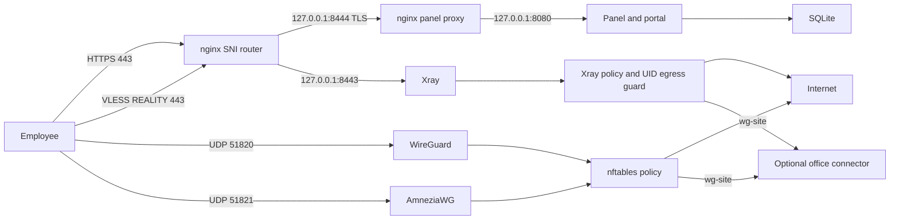

# Architecture

The gateway runs nginx, the FastAPI panel, kernel WireGuard, userspace AmneziaWG and Xray. The panel manages a SQLite identity/device database plus separate backend stores. Mutations use a thread lock and a filesystem lock shared with directory sync. Xray changes are validated and applied atomically with rollback.

AmneziaWG mirrors active WG peers by address offset between equal-size pools. Disabling a peer removes it from both interfaces. Each employee device has one owner, profile, protocol, expiry and lifecycle. VLESS client IDs are credentials; lists available to operators contain surrogate device IDs instead.

Own nftables tables provide NAT/MSS, baseline isolation and per-device access. The persisted policy loads before tunnels at boot. VLESS routing applies the same profile before administrator domain overrides. Its process-level output guard also blocks loopback and link-local destinations, including DNS rebinding to metadata.

The connector uses an outbound WireGuard link and masquerades only permitted corporate traffic into its LAN. Corporate DNS names can be routed through systemd-resolved with `vpn_panel_corp_domains`; otherwise configure the gateway's resolver explicitly. IPv6 transport inside tunnels is not supported.
